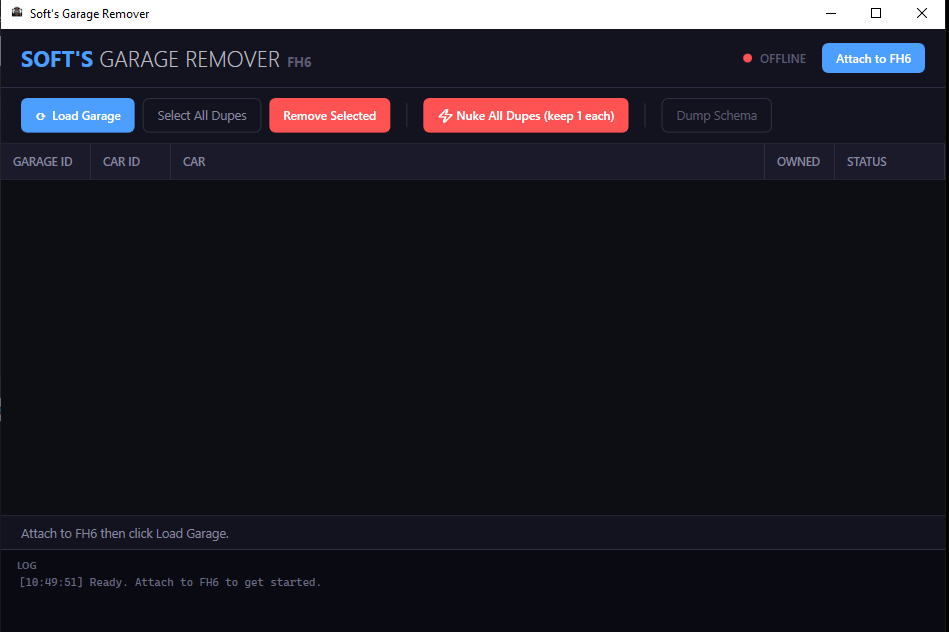

# 🚗 Soft's Garage Remover FH6

A real-time duplicate vehicle remover for Forza Horizon 6.

Soft's Garage Remover attaches directly to a running FH6 process, reads the garage database in memory, and allows players to identify and remove duplicate vehicles from their garage inventory.



---

## ✨ Features

- 🎮 Attach directly to FH6
- 🔍 Scan garage inventory for duplicate vehicles
- 📋 View Garage IDs and Car IDs
- 🗑️ Remove selected duplicate vehicles
- ⚡ Nuke all duplicates while keeping one of each model
- 🖥️ Modern and lightweight interface
- 🔒 No external servers or cloud services

---

## 🚀 How To Use

1. Launch Forza Horizon 6
2. Open Soft's Garage Remover
3. Click **Attach to FH6**
4. Click **Load Garage**
5. Review detected duplicate vehicles
6. Select duplicates manually or click **Nuke All Dupes**
7. Return to the garage in-game to refresh the vehicle list

---

## 🔒 Transparency

This project uses SQL queries against FH6's in-memory garage database.

The tool only interacts with garage vehicle records and does not modify unrelated game data.

### Duplicate Detection

```sql
SELECT count(*)
FROM Profile0_Career_Garage G2
WHERE G2.CarId = G.CarId
```

This query counts how many copies of each vehicle exist in the garage.

### Remove Selected Vehicle

```sql
DELETE FROM Profile0_Career_Garage
WHERE Id = <GarageId>
```

Removes only the selected garage entry.

### Nuke All Duplicates

```sql
DELETE FROM Garage
WHERE Id NOT IN (
    SELECT MIN(Id)
    FROM Garage
    GROUP BY CarId
)
```

Keeps one copy of every vehicle and removes additional duplicates.

---

## 🛡️ What This Tool Does NOT Do

- ❌ Does not modify credits
- ❌ Does not modify XP
- ❌ Does not modify wheelspins
- ❌ Does not unlock vehicles
- ❌ Does not add vehicles
- ❌ Does not communicate with external servers
- ❌ Does not collect personal information

The tool only reads and modifies garage vehicle entries.

---

## ⚠️ Disclaimer

This project is not affiliated with Microsoft, Turn 10 Studios, or Playground Games.

Use at your own risk.

---

## ❤️ Made By

**MyDadsSoft**

*"Keeping garages clean, one duplicate at a time."*
